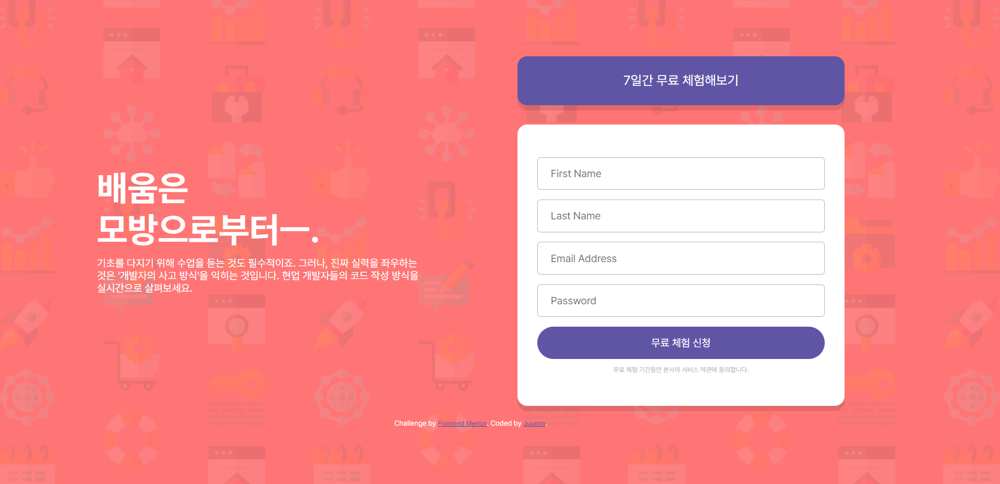
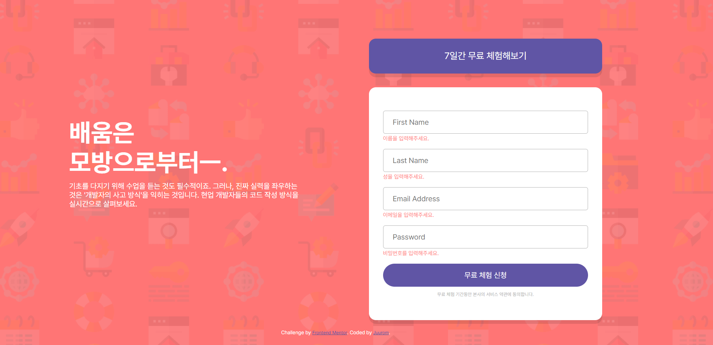
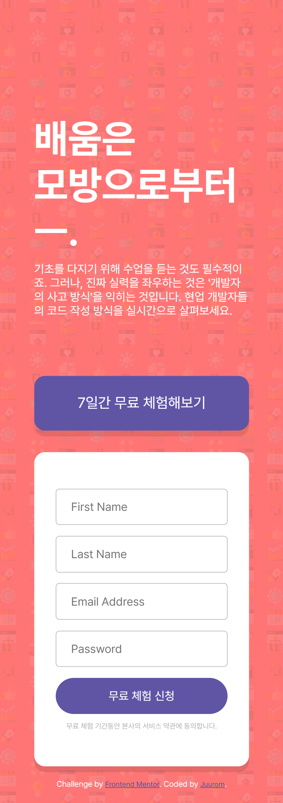
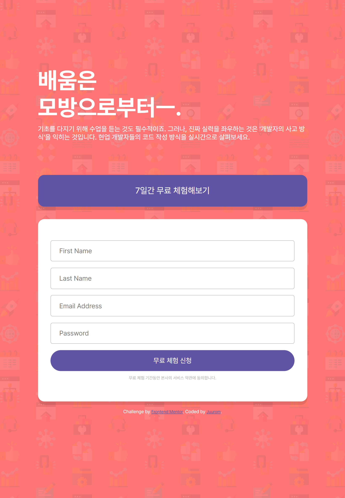

# Frontend Mentor - Intro component with sign up form solution

이 솔루션은 [Intro component with sign up form challenge on Frontend Mentor](https://www.frontendmentor.io/challenges/intro-component-with-signup-form-5cf91bd49edda32581d28fd1) 챌린지 참여 결과물입니다.

## 차례

- [소개](#소개)
  - [챌린지](#챌린지)
  - [화면 스크린샷](#화면-스크린샷)
  - [링크](#링크)
- [배운 점](#배운-점)
  - [사용 tool](#사용-tool)
  - [새롭게 배운 것](#새롭게-배운-것)
  - [앞으로 배울 것](#앞으로-배울-것)
  - [참고 사이트](#참고-사이트)
- [제작자](#제작자)
- [기타사항](#기타사항)

## 소개

### 챌린지

회원가입 폼을 반응형 웹으로 만들었다.
PC, 모바일, 패드 등의 환경에서 적절한 사이즈로
설명글과 입력폼이 보일 수 있도록 했다.
폼에는 이름, 성, 이메일, 비밀번호를 입력해야 한다.
입력하지 않으면 input 칸 하단에 에러 메시지가 보이도록 했다.

### 화면-스크린샷







### 링크

- Solution URL: [Github](https://github.com/juurom/Form___frontendMentor/)
- Live Site URL: [Live Site](https://juurom.github.io/Form___frontendMentor/)

## 배운-점

### 사용-tool

- HTML
- CSS
- JAVASCRIPT (Jquery)

### 새롭게-배운-것

1. 반응형 웹

사용자의 기기 디스플레이 크기에 맞게
콘텐츠의 크기를 조정하였다.

1) viewport를 기준으로 한 길이와 너비 값인 vh, vw를 단위로 사용하였다.

예를 들어 1280*800 화면에서
100vw = 1280px, 10vw = 128px
100vh = 800px, 5vw = 40px
이렇게 비례하여 변화한다.

학습에 참고한 사이트는 아래와 같다.

vh, vw 사용방법 
https://taimouse.tistory.com/8

2)폰트는 부모 요소의 폰트를 기준으로 변화하는 em, rem을 사용하였다.

찾아본 결과 html 전체에 font-size를 62.5%f로 주고,
15px은 1.5rem, 48px은 4.8rem 이런 식으로 쓰면 된다고 한다.
이렇게 하는 이유는, 사용자의 기기에서 폰트 크기가
기본값보다 크거나 작을 수 있기 때문이다.

학습에 참고한 사이트는 아래와 같다.

rem 사용방법
https://nykim.work/85


3) @media
@media(max-width:000px){}를 활용하면
000px보다 작은 화면일 시 대괄호 안에 있는 스타일이 적용된다.

예를 들어, id="a"인 요소의 기본 높이는 50인데
가로 길이가 820px 이하인 환경에서의 높이를 30으로
보이게 하고 싶다면, 아래와 같이 작성하면 된다.

CSS
```css
#a{
  height:50px;
}
@media(max-width:820px){
  #a{
    height:20px;
  }
}
```

만든 웹사이트에서 사용한 코드는 아래와 같다.

CSS
```css
body{
    display: inline-block;
    text-align: center;
    background-color: hsl(0, 100%, 73%);
    background-image: url(./images/bg-intro-desktop.png);
    background-size: 100%;
    color:white;
}

#left{
    min-height: 100%;
    text-align: left;
    margin-left:10%;
    margin-right:5%;
    width: 35%;
    height:100%;
    float:left;
}

#title{
    margin-top:250px;
    font-size: 5.4rem;
    font-weight: 700;
}

#right{
    min-height: 100%;
    margin-right:10%;
    margin-left:5%;
    width: 35%;
    height:100%;
    float:right;
}

@media (max-width: 820px){
    body{
        text-align: center;
        padding: 0vw 10vw;
    }
        
    #title{
        margin-top: 150px;
    }

    #left{
        width:auto;
        float:none;
        margin-left:0;
        margin-right:0;
    }
    #right{
        width:auto;
        float:none;
        margin-left:0;
        margin-right:0;
    }
}
```

2. footer 하단 고정

footer를 하단에 고정하기 위해 고군분투했으나...

![].(./footer고정시발.png)

한시간 넘게 찾아보고 고치고 했는데 안됐다.
그래도 새롭게 알게 된 것들은 많아서 배운 것들을 정리해보았다.

1) height:100%
100%는 부모 요소를 기준으로 100%이다.
부모 요소가 없으면 적용이 되지 않는다.

2) height:100vh
뷰포트 높이 전체를 height로 한다.
(근데 자꾸 쪼그만한 세로 스크롤이 생겼음... 왜일까?)

3) position:relative, absolute
static: html 기본값, 요소가 원래 있어야 하는 위치
relative: html 기본값을 기준으로 배치. 문서 흐름에 영향 o
(위치가 static일 때의 요소가 투명해지고 새로운 위치에 요소가 나타난다.)
absolute: 상위 요소를 기준으로 배치. 문서 흐름에 영향 x
(위치가 static일 때의 요소가 아예 제거되고 새로운 위치에 요소가 나타난다.)

4) block, inline
block은 한줄을 전부 차지하는 요소이다. (div, p처럼)
inline은 콘텐츠 크기만큼 차지하는 요소이다. (span처럼)
inline-block은 inlne처럼 콘텐츠 크기만큼 차지하는 요소이지만,
block처럼 width, height, margin, padding 등을 지정할 수 있다.
레이아웃에 inline-block을 활용할 수 있다.

HTML
```html
  <div id="social">

    <div id="icon">
      <div id="facebook">
      <a  href="https://www.facebook.com/">
        </a>
      </div>
    </div>
      <div id="icon">
        <div id="instagram">
      <a  href="https://www.instagram.com/">
      </a>
      </div>
    </div>
    <div id="icon">
      <div id="twitter">
      <a  href="https://twitter.com/">
        </a>
    </div>
  </div>

  </div>
```

3. padding 요소 크기 변화

input placeholder가 너무 왼쪽에 딱 붙어 있어서
보기 좋게 떨어뜨리려고 padding-left:20px;를 주었는데
input 박스 전체가 오른쪽으로 20px 더 길어지는 문제가 생겼다.

알고 보니 padding을 넣으면 그 크기만큼 요소가 커졌다.
예를 들어, 가로가 100px인 요소에 padding-left:20px;을 넣으면
요소의 총 길이는 120px이 된다.

그래서 이를 방지하기 위해서는
box-sizing: border-box;를 해 주어야 한다.
CSS
```css
#blank{
    box-sizing: border-box;
    height:50px;
    width:100%;
    border:1px solid hsl(0, 0%, 70%);
    border-radius: 5px;
    padding-left:20px;
}

```

box-sizing: contents-box;는 콘텐츠 크기를 기준으로
border, padding, margin이 더해져서,
콘텐츠 크기보다 최종 박스 크기가 더 커질 수 있다.
box-sigin: border-box;는 박스 전체 크기를 기준으로 그 안에
border, padding, margin을 집어넣어서,
콘텐츠 크기와 모든 여백을 합산했을 때 박스 크기가 나온다.

100*100인 div 안에 모든 것을 집어넣고 싶으면 border-box,
100*100인 컨텐츠 밖으로 여백을 더 두고 싶으면 contents-box를 선택한다.

참고 사이트는 아래와 같다.

border-box
https://dasima.xyz/css-box-sizing-content-box-vs-border-box/


### 앞으로-배울-것

css 기초 개념을 어떻게 활용할 지 전혀 감이 없는 것 같다.
더 많이 만들어 보고 더 많은 방법을 시도해 보아야겠다.

특히, 컴포넌트를 만들 때보다 페이지를 만들 때가 더 어려운 것 같다.
그 이유를 생각해 보니 내가 레이아웃을 짤 줄 모른다...
레이아웃을 어떻게 깔끔하게 정리할 수 있을지 많이 고민해보자.

그리고... 이번엔 실패했지만
다음 프로젝트에서는 꼭 footer를 항상 하단에
고정할 수 있는 방법을 찾아와서
그 방법을 계속해서 우려먹을 수 있게 해야겠다.

### 참고-사이트

- [Dalseo](https://www.daleseo.com/) - 개인 개발 블로그인 것 같은데 배울 게 많다!!!

- [vh, vw 사용방법](https://taimouse.tistory.com/8) - 앞으로 반응형 만들면서 계속 참고해야 할듯.
- [rem 사용방법](https://nykim.work/85) - 나는 이 분 포스팅으로 rem을 처음 사용해 볼 수 있었는데, 댓글 반응을 보니 전체 폰트 사이즈를 62.5%로 설정하는 방법이 꽤나 획기적인 방법인 것 같다... em, rem 사용해야 할 때 참고하면 좋을 것 같다.


## 제작자

- Github - [@juurom](https://github.com/juurom/)
- Frontend Mentor - [@yourusername](https://www.frontendmentor.io/profile/juurom)

## 기타사항
왜 안돼??? 라는 생각이 들면 그때부터 재밌는 것 같다.
왜냐면 그걸 해결하면 쾌감이 엄청날 걸 알고 있으니까... 6 ^ㅡ^
오늘도 footer 바닥에 박아넣다가 너무 화났고... 심지어 결국 해결도 못했지만
여러 가지 방법들을 찾아보면서 많은 것을 배울 수 있었다.
실패를 통해서 배우는 것들도 참 많다는 걸 항상 기억하자. ㅎㅎ